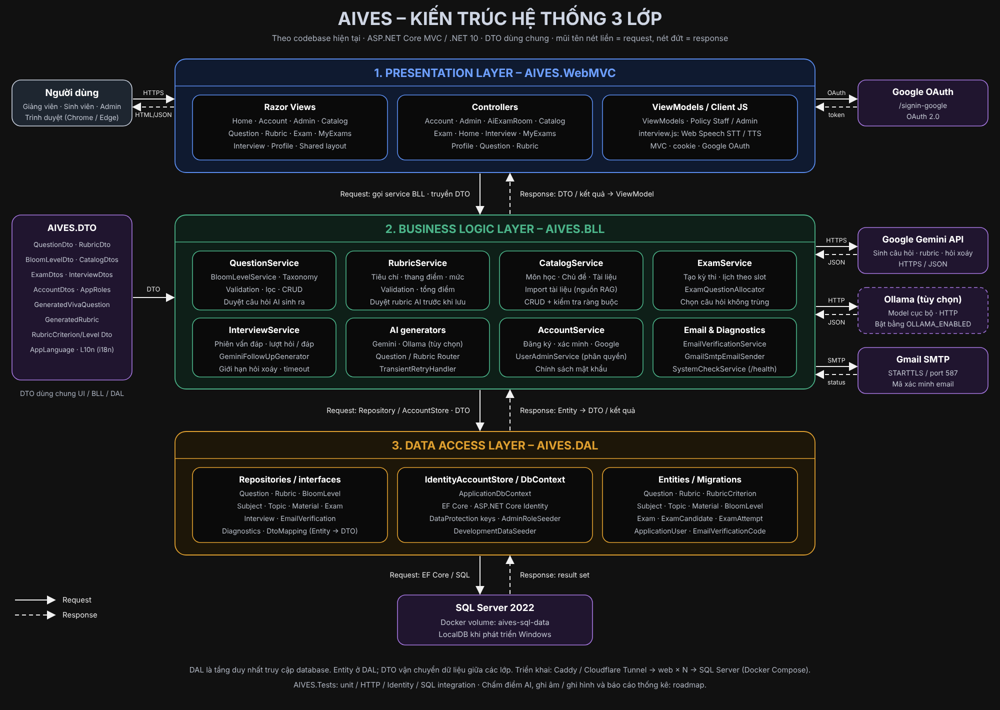

# AIVES System

AIVES là ứng dụng web hỗ trợ chuẩn bị và quản lý câu hỏi cho thi vấn đáp. Project sử dụng ASP.NET Core MVC, SQL Server, Gemini hoặc Ollama để tạo bản nháp câu hỏi bằng tiếng Việt. Định hướng phát triển là hỗ trợ quy trình thi vấn đáp có AI, trong đó giảng viên duyệt câu hỏi và quyết định điểm.

Phiên bản hiện tại bao phủ toàn bộ quy trình: **ngân hàng câu hỏi & rubric (tạo tay, nhập tệp, AI sinh có RAG trên giáo trình/slide), lập lịch kỳ thi, phỏng vấn AI bằng giọng nói có hỏi xoáy, AI đề xuất điểm để giảng viên quyết định, ghi âm/ghi hình làm bằng chứng, nhật ký kiểm tra, báo cáo lớp, xuất bảng điểm và quản trị hệ thống**.

## Chức năng hiện có

- **Tài khoản:** đăng ký bằng email thuộc các tên miền được phép (mặc định `gmail.com` và `fpt.edu.vn`, cấu hình qua `Registration:AllowedEmailDomains`; so khớp chính xác phần sau `@`), gửi mã xác minh qua SMTP, xác minh email, gửi lại mã, đăng nhập bằng mật khẩu, đăng xuất và đăng nhập Google khi được cấu hình.
- **Phân quyền:** ba vai trò `Admin`, `Lecturer` (giảng viên), `Student` (sinh viên). Mọi tài khoản mới (mật khẩu hoặc Google) là `Student` và **không** vào được ngân hàng câu hỏi, rubric hay danh mục; chỉ `Lecturer` và `Admin` dùng được các trang này. Admin (đặt qua `AdminAccess:Emails`/`ADMIN_EMAIL`) nâng/hạ vai trò Giảng viên ↔ Sinh viên ở trang **Users** (`/Admin/Users`); thay đổi áp dụng cho phiên đang mở trong vòng một phút. Tài khoản tạo trước khi có phân quyền được gán `Student` ở lần khởi động (migrate) đầu tiên sau khi nâng cấp. Tài khoản phát triển (`Development:TestAccount`) và tài khoản demo (`DemoAccount`) được gán `Lecturer`.
- **Kỳ thi & lịch thi:** giảng viên tạo phiên thi vấn đáp (`/Exam`) gắn môn học (và chủ đề), giờ bắt đầu, số phút mỗi thí sinh, số câu hỏi chính và số câu hỏi đào sâu tối đa, danh sách thí sinh theo email (dán mỗi dòng một email, theo thứ tự thi). Khung giờ từng thí sinh được tính nối tiếp. Hệ thống rút bộ câu hỏi chính riêng cho từng thí sinh từ các câu đang hoạt động của môn/chủ đề: ưu tiên không trùng với các thí sinh thi liền trước (tránh tới 3 người khi ngân hàng đủ lớn), dùng đều các câu, rồi đa dạng mức Bloom; nếu ngân hàng quá nhỏ thì cảnh báo số câu trùng. Nội dung câu được sao lưu lúc giao nên sửa/xóa câu gốc không đổi hồ sơ kỳ thi. Giảng viên chỉ thấy kỳ thi của mình (admin thấy tất cả); sau giờ bắt đầu không sửa/rút lại được. Sinh viên xem khung giờ của mình ở **Lịch thi của tôi** (`/MyExams`), không thấy câu hỏi. Giờ nhập/hiển thị theo `Exams:TimeZone` (mặc định `Asia/Ho_Chi_Minh`).
- **Phỏng vấn AI (giám khảo ảo):** trong khung giờ của mình, sinh viên mở **Lịch thi của tôi → Bắt đầu vấn đáp**. Trình duyệt đọc to từng câu hỏi (Web Speech `speechSynthesis`) và nhận dạng câu trả lời theo thời gian gần thực (`SpeechRecognition`, Chrome/Edge; trình duyệt khác thì gõ phím, được ghi nhận là *Gõ phím*). Sau mỗi câu trả lời, Gemini (`Interview:Model`, mặc định `gemini-3.5-flash-lite`, ~1 giây) đánh giá câu trả lời so với đáp án mong đợi và quyết định **đủ ý** hay **mơ hồ / thiếu ý / mâu thuẫn / lạc đề**; nếu chưa đủ thì sinh **một câu hỏi xoáy** nhắm vào chỗ đó. Giới hạn: thời gian trả lời mỗi câu (tự nộp khi hết giờ, trả lời trễ bị đánh dấu *Quá giờ*), số câu xoáy tối đa mỗi câu chính và mỗi thí sinh, ngôn ngữ phỏng vấn (Việt/Anh) theo kỳ thi. AI lỗi hoặc quá `Interview:AiTimeoutSeconds` thì chuyển sang câu tiếp theo, không làm treo buổi thi. Lời sinh viên được đưa vào prompt như dữ liệu, có rào chống prompt injection. Chỉ phần chữ được gửi lên server và lưu lại (âm thanh do dịch vụ giọng nói của trình duyệt xử lý); giảng viên xem toàn bộ hỏi–đáp cùng lý do quyết định của AI trong trang chi tiết kỳ thi.
- **Chấm điểm có AI hỗ trợ (human-in-the-loop):** khi buổi vấn đáp kết thúc, một worker nền (chạy trên mọi replica, có cơ chế "claim" trong DB để không chấm trùng) gửi từng câu chính kèm các câu hỏi xoáy và câu trả lời cho Gemini (`Grading:Model`, trống thì dùng `Gemini:Model`). AI đối chiếu với đáp án mong đợi và **rubric được chụp lại lúc giao câu hỏi** (sửa rubric trong ngân hàng không làm đổi cách chấm kỳ thi cũ): chọn mức đạt cho từng tiêu chí, nêu điểm mạnh, điểm yếu, ý còn thiếu và nhận xét. Điểm được kẹp trong thang của tiêu chí và tổng do server tự cộng. Câu không trả lời được 0 điểm mà không gọi AI. Giảng viên mở **Chấm điểm** (`/Grading`) để xem transcript đầy đủ, nghe/xem bản ghi, điểm AI đề xuất và các tín hiệu phụ (thời gian bắt đầu trả lời, thời lượng, tốc độ nói, số từ ngập ngừng, quá giờ, gõ phím, số câu xoáy) — tín hiệu chỉ để tham khảo, không cộng vào điểm. Giảng viên nhập điểm từng câu (điền sẵn đề xuất của AI), nhận xét, **lưu nháp** hoặc **chốt điểm**; điểm tổng quy về thang 10. Chỉ khi chốt thì sinh viên mới thấy kết quả; muốn sửa phải **mở lại**. Có nút yêu cầu AI chấm lại (giữ điểm giảng viên đã nhập).
- **Ghi âm/ghi hình & bảo mật:** mỗi kỳ thi chọn *ghi âm*, *ghi âm + camera* hoặc *không ghi*. Sinh viên phải tích đồng ý trước khi bắt đầu (thời điểm đồng ý được lưu). Trình duyệt ghi từng câu trả lời bằng `MediaRecorder` và tải lên sau khi nộp; server **mã hoá bằng khoá Data Protection** trước khi ghi ra volume dùng chung `aives-recordings`. Chỉ giảng viên của kỳ thi và admin phát được bản ghi, mỗi lần phát đều ghi nhật ký; bản ghi tự xoá sau thời hạn lưu (mặc định 365 ngày, đổi ở trang cấu hình).
- **Nhật ký kiểm tra (audit log):** ghi lại tạo/sửa/xoá kỳ thi, bắt đầu/kết thúc vấn đáp, đồng ý ghi âm, mỗi đề xuất của AI, mỗi lần đổi điểm (điểm cũ → mới, kèm điểm AI), chốt/mở lại điểm, phát bản ghi, xuất bảng điểm, đổi vai trò/khóa tài khoản, phân công môn, đổi cấu hình. Xem theo kỳ thi (`/Grading/Audit/{id}`) hoặc toàn hệ thống (`/Admin/Audit`). Toàn bộ hỏi–đáp vẫn được lưu từng lượt như trước.
- **Báo cáo:** sinh viên xem **Kết quả** trong *Lịch thi của tôi* sau khi điểm được chốt: điểm từng câu, nhận xét của giảng viên và AI, câu trả lời của mình. Giảng viên xem **Báo cáo lớp** (`/Reports`): số đã thi/đã chốt, điểm trung bình/trung vị/min/max, tỷ lệ đạt từ 5, biểu đồ phân bố điểm, câu hỏi khó nhất (tỷ lệ điểm đạt, tỷ lệ trả lời tốt ≥70%, số câu xoáy, số lần đủ ý ngay), theo mức Bloom, và độ trễ của giám khảo AI (trung bình, p95). **Xuất bảng điểm Excel** theo mẫu: tên trường (`Reports:SchoolName`), môn, kỳ thi, ngày thi, STT, MSSV (tách từ email FPT), họ tên, điểm từng câu, tổng thang 10, ghi chú, chữ ký.
- **Quản trị:** trang Users có lọc, đổi vai trò và **vô hiệu hoá/kích hoạt** tài khoản (đăng xuất ngay các phiên đang mở). **Phân công giảng viên theo môn** (`/Admin/Subjects`): môn đã phân công thì chỉ giảng viên được chọn mới tạo kỳ thi cho môn đó; môn chưa phân công thì mọi giảng viên dùng được. **Cấu hình giọng nói & ghi âm** (`/Admin/Settings`): ngôn ngữ phỏng vấn được bật (Việt/Anh) và mặc định, tốc độ đọc, giọng ưu tiên cho từng ngôn ngữ (có nghe thử), thời hạn lưu bản ghi.
- **Độ chính xác STT cho thuật ngữ:** mỗi môn có danh sách **thuật ngữ** (`/Glossary`) kèm các cách bị nhận sai (ví dụ `SQL` ← "ét kiu eo"). Câu trả lời được sửa theo nguyên từ trước khi lưu (bản gốc vẫn giữ để đối chiếu), thuật ngữ được gửi cho trình nhận dạng (khi trình duyệt hỗ trợ phrase biasing) và được báo cho AI hỏi xoáy/AI chấm điểm.
- **Độ trễ:** thời gian AI quyết định sau mỗi câu trả lời được đo và lưu từng lượt, hiển thị trong báo cáo lớp để theo dõi nhịp vấn đáp.
- **Ngân hàng câu hỏi:** năm tab **Bank | Create | AI generation | Bulk generation | Import**. Tab Import đọc câu hỏi từ `.csv`, `.xlsx`, `.json` (tên cột tiếng Anh hoặc tiếng Việt, mức Bloom nhận tên Anh/Việt hoặc 1–6, có tệp mẫu) rồi đưa vào cùng màn hình duyệt như câu AI sinh. Ở màn hình duyệt, giảng viên **sửa nội dung, đáp án mong đợi, mức Bloom, độ khó**, bỏ chọn câu không dùng và gắn rubric trước khi lưu vào ngân hàng chính thức. Tab Bank thêm, xem danh sách/chi tiết, sửa, xóa và lọc theo mức Bloom; lưu ngữ cảnh, đáp án mong đợi, rubric, thứ tự hiển thị và trạng thái hoạt động. Rubric là tuỳ chọn.
- **Tạo hàng loạt bằng AI:** chọn một kế hoạch sinh (môn học, chủ đề, số câu, độ khó, mức Bloom), xem trước toàn bộ kết quả, chỉnh sửa câu nào giữ và bỏ câu nào, rồi mới lưu hàng loạt vào ngân hàng. Mức Bloom của kế hoạch được gán server-side từ tên do AI trả về.
- **Ngân hàng rubric:** ba tab **Bank | Create | AI generation**. Mỗi rubric là một ma trận do người dùng tự định nghĩa: 1–10 dòng tiêu chí và 2–6 cột mức đánh giá. Mỗi ô ghi mô tả riêng và điểm riêng. Mức `MaxPoints` của tiêu chí lấy bằng điểm cao nhất trong dòng, `TotalPoints` của rubric lấy bằng tổng các tiêu chí, nên người dùng không phải tự cộng.
- **Trình biên tập ma trận:** thêm/xoá/đổi tên dòng và cột trực tiếp; ma trận luôn hình chữ nhật. Trùng tên mức, ô mồ côi, ô trùng hoặc ma trận không đủ điều kiện đều bị từ chối kèm thông báo.
- **Sinh rubric bằng AI:** cùng cơ chế provider với câu hỏi (ưu tiên Gemini, tự chuyển sang Ollama), sinh ra một ma trận hoàn chỉnh để giảng viên duyệt rồi lưu.
- **Danh mục:** mức Bloom, môn học, chủ đề, tài liệu và rubric được truy xuất qua service/repository để chọn khi tạo câu hỏi.
- **Môn học / chủ đề / tài liệu:** CRUD đầy đủ cho ba cấp danh mục, nhập **giáo trình và slide bài giảng** từ `.pdf`, `.docx`, `.pptx` (giữ tiêu đề "Page n"/"Slide n" và ghi chú của slide) cùng `.txt`, `.md`, `.csv`, `.json` (tối đa 20 MB). **RAG:** tài liệu được chia thành đoạn có chồng lấn, xếp hạng BM25 theo từ đơn và cặp từ (phù hợp thuật ngữ tiếng Việt nhiều âm tiết), chỉ các đoạn liên quan được đưa vào prompt sinh câu hỏi/rubric.
- **Gemini / Ollama:** tạo từ 1 đến 10 câu hỏi theo môn học, chủ đề, chuẩn đầu ra và độ khó, có thể lấy thêm tài liệu của chủ đề làm ngữ cảnh. Router ưu tiên Gemini và tự chuyển sang mô hình Ollama cục bộ khi Gemini chưa cấu hình. Mỗi câu có đáp án mong đợi, mức Bloom và 2 câu hỏi đào sâu. Kết quả là bản nháp để giảng viên duyệt, chưa tự động lưu vào ngân hàng.
- **Bảng trượt AI:** nút **Generate with AI** trên `Question/Create` mở một bảng trượt nhỏ gọn. Chọn bộ sinh, bật/tắt việc dùng tài liệu làm ngữ cảnh, bấm **Use this question** để đổ kết quả vào `Content`, `ExpectedAnswer` và `Bloom level` của biểu mẫu đang mở.
- **AI exam room (cũ):** được thay bằng phỏng vấn AI ở *Lịch thi của tôi*; các đường dẫn cũ chuyển hướng về `Question/Create?slide=aiPanel`.
- **Đa ngôn ngữ:** toàn bộ giao diện và thông báo hỗ trợ English và Tiếng Việt.
- **Giao diện:** trang tổng quan và menu responsive cho desktop/mobile.

Giới hạn đã biết: nhận dạng giọng nói dùng dịch vụ của trình duyệt (Chrome/Edge), nên độ chính xác phụ thuộc trình duyệt; danh sách thuật ngữ giúp sửa các lỗi lặp lại nhưng không thay được mô hình STT chuyên biệt. Bảng điểm xuất theo bố cục phổ biến; nếu trường có mẫu riêng, chỉnh `GradeSheetBuilder`.

## Công nghệ

| Thành phần | Công nghệ |
|---|---|
| Runtime | .NET 10, C# |
| Presentation | ASP.NET Core MVC, Razor, Bootstrap, JavaScript |
| Dữ liệu | EF Core 10, SQL Server, EF migrations |
| Xác thực | ASP.NET Core Identity, cookie, Google OAuth |
| Tích hợp | Gemini API, Ollama (`phi3:mini`), Gmail SMTP |
| Kiểm thử | xUnit, ASP.NET Core TestServer, EF InMemory và SQL Server thật |
| Đóng gói | Dockerfile nhiều giai đoạn, Docker Compose |

## Kiến trúc 3 Layer + DTO



```text
AIVES_System/
├── AIVES.WebRazor/  # Presentation: Razor Pages, PageModels, wwwroot, HTTP and SignalR
├── AIVES.BLL/       # Business: service, validation, quy tắc và điều phối nghiệp vụ
├── AIVES.DAL/       # Data Access: EF Core, repository, Identity store, migrations
├── AIVES.DTO/       # Đối tượng truyền dữ liệu dùng chung
├── AIVES.Tests/     # Kiểm thử unit, HTTP, Identity và SQL integration
├── docs/            # Tài liệu kiến trúc, báo cáo và bằng chứng kiểm thử
├── scripts/         # Công cụ kiểm tra SMTP
├── AIVES_System.slnx
├── compose.yaml
└── DEPLOY.md
```

Luồng xử lý: **Người dùng → WebRazor → BLL → DAL → SQL Server**, kết quả đi ngược lại qua DTO. WebRazor tham chiếu BLL và DTO; BLL tham chiếu DAL và DTO; DAL là nơi duy nhất truy cập database. DTO không chứa truy vấn hay logic xử lý nghiệp vụ.

WebRazor xử lý Razor Pages, form/HTTP, cookie và Google OAuth. BLL kiểm tra dữ liệu, chính sách tài khoản, OTP và điều phối AI/email. DAL ánh xạ DTO với entity, thực hiện truy vấn/lưu trữ và chứa toàn bộ migrations. Ba layer là phân chia trách nhiệm trong mã nguồn, không yêu cầu ba máy chủ triển khai.

Xem [tài liệu kiến trúc](docs/AIVES-3-Layer-Architecture.md).

## Giao diện Razor Pages

`AIVES.WebRazor/` là tầng Presentation duy nhất, viết bằng **ASP.NET Core Razor Pages**. Toàn bộ giao diện, luồng tài khoản và chức năng từ tầng WebMVC đã được chuyển sang PageModels và Razor Pages; BLL, DAL và DTO được dùng lại nguyên trạng. WebRazor chỉ tham chiếu BLL và DTO (kiểm tra bằng test ranh giới assembly).

| Khu vực | Nội dung |
|---|---|
| Tổng quan | Trang chính và số liệu theo quyền tài khoản |
| Tài khoản | Đăng nhập, đăng ký, xác minh email, gửi lại mã, Google OAuth, hồ sơ và đăng xuất |
| Ngân hàng | Câu hỏi, rubric ma trận, tạo/duyệt câu hỏi bằng AI, nhập liệu và danh mục tài liệu |
| Kỳ thi | Tạo/sửa lịch, phân công, lịch biểu, trạng thái thí sinh và phòng vấn đáp |
| Chấm điểm | Transcript/recording, đề xuất AI, xác nhận điểm, báo cáo và xuất bảng điểm |
| Quản trị | Tài khoản, phân quyền, phân công giảng viên, cài đặt giọng nói và audit log |

Phân quyền khai báo bằng Razor Pages conventions trong `RazorPresentation.cs`: người dùng phải đăng nhập; các trang staff và admin dùng policy theo vai trò. Các form giữ antiforgery validation và các luồng real-time tiếp tục dùng SignalR.

### Lõi phỏng vấn AI bằng giọng nói (nhóm chức năng 3)

Giám khảo AI đọc câu hỏi, sinh viên trả lời bằng giọng nói, chữ hiện ra gần như ngay lập tức, và AI hỏi xoáy khi câu trả lời còn mơ hồ, thiếu ý, mâu thuẫn hoặc lạc đề. Phần giọng nói chạy **offline trên máy chủ bằng package NuGet**, không phụ thuộc trình duyệt:

| Phần | Package / lớp | Ghi chú |
|---|---|---|
| Đọc câu hỏi (TTS) | `org.k2fsa.sherpa-onnx` + giọng Piper `vi_VN-vais1000-medium` / `en_US-amy-low`, lớp `BLL/Services/Speech/SherpaTextToSpeech` | Trang phòng thi lấy WAV qua handler `?handler=QuestionAudio`, chỉ cho câu hỏi đang mở; kết quả được cache theo nội dung câu |
| Nghe câu trả lời (STT) | `Whisper.net` + `Whisper.net.Runtime` (CPU) + `Whisper.net.Runtime.Vulkan` (GPU), lớp `WhisperSpeechToText` | Dùng câu hỏi và thuật ngữ môn học làm prompt; bỏ đoạn im lặng và các câu Whisper hay "bịa" |
| Gần thời gian thực | `LiveTranscriber` + `Realtime/InterviewHub.cs` (`/hubs/interview`) | Trình duyệt thu micro bằng AudioWorklet, chuyển về 16 kHz PCM, gửi từng khối 250 ms qua **SignalR client-to-server streaming**. Máy chủ đọc lại phần đuôi khoảng mỗi 1,5 giây (`Transcript`), và chốt từng đoạn khoảng 8 giây tại chỗ ngắt hơi, nên bản cuối chỉ còn vài giây phải nhận dạng |
| Hỏi xoáy thích ứng | `IInterviewService` + `GeminiFollowUpGenerator` (đã có) | AI phân loại câu trả lời (`Sufficient`, `Vague`, `Missing`, `Contradiction`, `OffTopic`) và viết câu hỏi xoáy; quá thời gian chờ thì chuyển câu, không làm treo buổi thi |
| Giới hạn | `AnswerTimeLimitSeconds`, `MaxFollowUpsPerQuestion`, `MaxFollowUpQuestions` của kỳ thi | Đồng hồ đếm ngược trên trang, hết giờ thì tự nộp; máy chủ không nhận âm thanh quá giới hạn, và BLL đánh dấu `timedOut` |
| Giám sát | `InterviewEvent` gửi tới nhóm `exam-{id}` | Giảng viên thấy câu hỏi, chữ sinh viên đang nói, câu trả lời, câu hỏi xoáy và lúc hoàn thành |

Chữ nhận dạng giữ nguyên thì được ghi là `Speech`; phần sinh viên sửa lại thì được ghi là `Typed`, để giảng viên phân biệt. Kỳ thi có ghi âm (`Recording = Audio`) sẽ lưu file WAV của từng câu trả lời (được mã hoá) qua `IRecordingService`. Kỳ thi ghi hình (`AudioVideo`) vẫn làm trên site MVC.

**Cài model** (khoảng 600 MB, nằm trong `AIVES.WebRazor/App_Data/speech-models`, không commit):

```powershell
.\scripts\download-speech-models.ps1            # Whisper small + giọng Việt và Anh
.\scripts\download-speech-models.ps1 -WithPreviewModel   # thêm ggml-base cho bản xem trước nhanh hơn trên CPU
```

Đo ngày 08/10/2026 trên máy chủ (GTX 1070, Vulkan): đọc một câu hỏi mất 0,3–0,6 giây (lần đầu khoảng 2,7 giây do nạp model); chữ tạm cập nhật khoảng mỗi 1,6 giây khi đang nói; bản cuối có sau khi ngừng nói 0,7–2,9 giây; Gemini quyết định hỏi xoáy trong khoảng 1,2–1,6 giây. Chỉ có CPU thì Whisper small chậm hơn khoảng 6 lần, nên đặt `Speech:WhisperPreviewModel` là `whisper/ggml-base.bin`. Thiếu model thì phòng thi tự chuyển sang chế độ gõ câu trả lời. Cấu hình nằm trong mục `Speech` (`SpeechOptions`).

#### Kết hợp với Gemini (tuỳ chọn)

Mặc định mọi thứ chạy tại chỗ. Khi đã có `Gemini:ApiKey`, có thể bật thêm:

| Cấu hình | Tác dụng |
|---|---|
| `Speech:Provider = Gemini` | Chữ tạm khi đang nói vẫn do Whisper làm. Khi sinh viên ngừng nói, **toàn bộ** câu trả lời được gửi cho `gemini-3.5-transcribe` (Interactions API, `vi-VN`, chế độ `verbatim`, `custom_vocabulary` là **bảng thuật ngữ môn học**) **song song** với lượt chốt cuối của Whisper. Sinh viên thấy bản của Whisper trước, rồi bản của Gemini thay vào. Gemini lỗi, bị 429 hoặc quá `Speech:GeminiTimeoutSeconds` (10 giây) thì giữ bản của Whisper; sau lỗi 429, hệ thống ngưng gọi Gemini trong khoảng thời gian API yêu cầu. Không cài Whisper nhưng bật Gemini thì vẫn thi bằng giọng nói được, chỉ không có chữ tạm. |
| `Speech:TtsProvider = Gemini` | Đọc câu hỏi bằng `gemini-3.8-flash-lite-tts` (giọng `Speech:GeminiVoice`), có cache; lỗi thì dùng giọng sherpa-onnx tại chỗ. |

Đo ngày 08/10/2026 với key gói miễn phí:
- Gemini viết đúng phần tiếng Việt mà Whisper nghe sai ("Lớp **giao diện**… lớp **nghiệp vụ**… **xử lý**… **đọc ghi**", trong khi Whisper ra "sau diện… nghiệp phụ… sự lý… độc ký").
- Bản cuối của Gemini có sau khi ngừng nói khoảng 5–8 giây.
- Gói miễn phí chỉ cho **3 request/phút** với model Transcribe, nên khi nhiều sinh viên thi cùng lúc thì phần lớn câu trả lời sẽ quay về Whisper.
- Gemini TTS mất 8–9 giây mỗi câu, và câu hỏi xoáy được sinh ra ngay lúc thi nên không cache trước được. Vì vậy mặc định vẫn là TTS tại chỗ.

Cần lưu ý trước khi bật `Provider = Gemini` cho bài thi thật:
- Gặp tên tiếng Anh phát âm không rõ, Gemini **đoán** ra một cụm nghe hợp lý thay vì ghi sai như Whisper. Ví dụ: với giọng máy đọc "SignalR… qua WebSocket", chế độ `smart` ghi thành "Server-Sent Events… qua HTTP", và chế độ `verbatim` ghi thành "…qua SSE". Giám khảo AI sau đó hỏi xoáy về điều sinh viên không nói. Code dùng `verbatim` (theo tài liệu là ghi đúng từng từ) và **không** đưa thuật ngữ trong câu hỏi vào `custom_vocabulary`, vì làm vậy từng biến "WebSocket" thành "ASP.NET Core". Các phép đo này dùng giọng máy đọc; cần thử với giọng sinh viên thật trước khi dùng cho bài thi.
- Sinh viên luôn xem và có thể sửa bản chữ trước khi nộp (phần sửa được ghi là `Typed`), và bài thi có ghi âm vẫn giữ file WAV để giảng viên nghe lại.
- Âm thanh câu trả lời được gửi tới Google. Gói miễn phí có thể dùng dữ liệu để cải thiện sản phẩm, nên với bài thi thật nên dùng gói trả phí và báo trước cho sinh viên.

**Real-time với SignalR.** Có một hub là `Realtime/AivesHub.cs` tại `/hubs/aives` (`[Authorize]`, client strongly-typed `IAivesClient`):

- **Đang online:** `PresenceTracker` đếm người dùng (nhiều tab tính là một người) và đẩy `PresenceChanged` cho mọi client.
- **Đồng bộ dữ liệu:** sau khi BLL lưu thành công, PageModel gọi `ILiveUpdates.EntityChangedAsync(...)` để gửi `EntityChanged` vào nhóm `staff`. Trang danh sách tự tải lại vùng bảng qua handler `?handler=Rows` / `?handler=Topics`, trang tổng quan cập nhật số liệu qua `?handler=Stats`, và đồng nghiệp nhận toast. Sinh viên không thuộc nhóm `staff` nên không bao giờ nhận được nội dung câu hỏi.
- **Cùng chỉnh sửa:** trang `Questions/Edit` gọi `JoinQuestion(id)`, nên mọi người đang mở cùng câu hỏi thấy tên nhau (`EditorsChanged`). Khi người khác lưu hoặc xoá câu hỏi đó, trang hiện cảnh báo, và với trường hợp xoá thì khoá luôn nút Lưu.

SignalR thuộc về tầng Presentation; BLL không biết gì về SignalR. `PresenceTracker` lưu trong bộ nhớ, nên đúng với **một** instance web. Nếu chạy nhiều bản sao (như `compose.yaml` của site MVC) thì cần thêm backplane, ví dụ Redis.

Chạy (cùng database với site MVC, cổng 5301):

```powershell
dotnet run --project AIVES.WebRazor --launch-profile http
```

Trong Docker Compose, site này là service `razor` (một instance, Whisper chạy trên CPU, model được mount từ máy chủ). Xem mục *Site Razor Pages và phỏng vấn bằng giọng nói* trong [DEPLOY.md](DEPLOY.md).

Để thấy real-time: mở hai cửa sổ (hoặc một cửa sổ ẩn danh với tài khoản giảng viên khác) ở `/Questions` và `/`, rồi thêm, sửa hoặc xoá câu hỏi ở một cửa sổ.

## Chạy bằng .NET

### Điều kiện

- .NET SDK 10.
- SQL Server có thể kết nối; cấu hình mặc định dùng SQL Server LocalDB trên Windows.
- Visual Studio hỗ trợ .NET 10 và solution `.slnx`, hoặc dùng CLI.

Mở `AIVES_System.slnx` tại thư mục gốc; chọn `AIVES.WebMVC` làm startup project nếu dùng Visual Studio.

```powershell
dotnet restore AIVES_System.slnx
dotnet build AIVES_System.slnx -c Release

# Chỉ cần thay connection nếu không dùng LocalDB mặc định.
dotnet user-secrets set "ConnectionStrings:DefaultConnection" "<SQL_SERVER_CONNECTION_STRING>" --project AIVES.WebRazor

dotnet run --project AIVES.WebRazor --launch-profile https
```

Profile HTTPS mở ứng dụng tại `https://localhost:7195` (HTTP: `http://localhost:5201`). Có thể chạy `dotnet dev-certs https --trust` trên máy phát triển nếu cần tin cậy chứng chỉ HTTPS local.

Ứng dụng áp dụng migrations khi khởi động; tài khoản database cần quyền phù hợp. Môi trường Development có seed dữ liệu mẫu. Không đặt connection string chứa mật khẩu vào Git.

### Cấu hình dịch vụ ngoài

Lưu các giá trị thật bằng User Secrets khi phát triển; dùng biến môi trường khi triển khai. Các giá trị `<...>` dưới đây là placeholder, phải thay trước khi chạy.

```powershell
# Tạo câu hỏi AI
dotnet user-secrets set "Gemini:ApiKey" "<GEMINI_API_KEY>" --project AIVES.WebRazor
dotnet user-secrets set "Gemini:Model" "<MODEL_AVAILABLE_TO_YOUR_ACCOUNT>" --project AIVES.WebRazor

# Fallback cục bộ bằng Ollama (tùy chọn)
dotnet user-secrets set "Ollama:Enabled" "true" --project AIVES.WebRazor
dotnet user-secrets set "Ollama:Model" "phi3:mini" --project AIVES.WebRazor
dotnet user-secrets set "Ollama:BaseUrl" "http://localhost:11434" --project AIVES.WebRazor
dotnet user-secrets set "Ollama:MaxContextCharacters" "6000" --project AIVES.WebRazor

# Gửi mã xác minh email
dotnet user-secrets set "GmailSmtp:Username" "<GMAIL_ADDRESS>" --project AIVES.WebRazor
dotnet user-secrets set "GmailSmtp:AppPassword" "<GMAIL_APP_PASSWORD>" --project AIVES.WebRazor

# Đăng nhập Google (tùy chọn)
dotnet user-secrets set "Authentication:Google:ClientId" "<GOOGLE_CLIENT_ID>" --project AIVES.WebRazor
dotnet user-secrets set "Authentication:Google:ClientSecret" "<GOOGLE_CLIENT_SECRET>" --project AIVES.WebRazor
```

SMTP mặc định là `smtp.gmail.com:587`. Google callback dùng đường dẫn `/signin-google`; đăng ký URI tương ứng với địa chỉ ứng dụng, ví dụ `https://localhost:7195/signin-google` khi dùng profile HTTPS.

Nếu chưa có Gemini key, giao diện AI báo chưa cấu hình. Nếu SMTP chưa cấu hình, đăng ký không thể gửi mã xác minh. Có thể cấu hình tài khoản phát triển qua `Development:TestAccount:Email`, `Password`, `DisplayName` trong User Secrets; tài khoản này chỉ được tạo khi chạy Development.

Model mặc định trong repository là `gemini-3.8-flash`; cần kiểm tra model và quyền truy cập thực tế của tài khoản trước khi sử dụng.

### Tài khoản demo khi phát triển

Khi chưa cấu hình SMTP, có thể tạo sẵn hai tài khoản đã xác minh email để đăng nhập ngay: một giảng viên (user thường) và một admin. Tài khoản được tạo khi ứng dụng khởi động; mật khẩu tối thiểu 8 ký tự và có ít nhất một chữ số.

```powershell
# Giảng viên — chỉ được tạo khi chạy Development
dotnet user-secrets set "Development:TestAccount:Email" "lecturer.demo@gmail.com" --project AIVES.WebRazor
dotnet user-secrets set "Development:TestAccount:Password" "<LECTURER_PASSWORD>" --project AIVES.WebRazor
dotnet user-secrets set "Development:TestAccount:DisplayName" "Giảng viên Demo" --project AIVES.WebRazor

# Admin — tài khoản demo được gán quyền qua AdminAccess:Emails
dotnet user-secrets set "DemoAccount:Enabled" "true" --project AIVES.WebRazor
dotnet user-secrets set "DemoAccount:Email" "admin.demo@gmail.com" --project AIVES.WebRazor
dotnet user-secrets set "DemoAccount:Password" "<ADMIN_PASSWORD>" --project AIVES.WebRazor
dotnet user-secrets set "DemoAccount:DisplayName" "Admin Demo" --project AIVES.WebRazor
dotnet user-secrets set "AdminAccess:Emails:0" "admin.demo@gmail.com" --project AIVES.WebRazor
```

Khởi động lại ứng dụng rồi đăng nhập tại `/Account/Login`. Tài khoản giảng viên truy cập ngân hàng câu hỏi, AI và Profile; chỉ tài khoản admin vào được `/Admin`. Nếu đặt thêm `DemoAccount:ResetPasswordOnStartup` là `true`, mật khẩu admin sẽ được đặt lại theo cấu hình mỗi lần khởi động. Không commit mật khẩu thật vào Git.

## Danh mục Môn học → Chủ đề → Tài liệu

Ngoài ngân hàng câu hỏi, hệ thống có một danh mục phục vụ việc tạo câu hỏi bằng AI:

- **Môn học (Subject)** → **Chủ đề (Topic)** → **Tài liệu (Material)**. Xóa môn học hoặc chủ đề sẽ xóa luôn cấp con (cascade). `Question.TopicId` là khóa ngoại nullable, xóa chủ đề chỉ gỡ liên kết chứ không xóa câu hỏi.
- `Material/Import` nhận tệp `.txt`, `.md`, `.csv`, `.json` tối đa 2 MB; tên tệp thành tiêu đề tài liệu và nội dung được lưu nguyên văn.
- `CatalogService.BuildRagContextAsync` chấm điểm tài liệu đang hoạt động theo các từ khóa của yêu cầu, chỉ giữ tối đa 6 tài liệu khớp nhất và cắt theo `Ollama:MaxContextCharacters`. Không có tài liệu khớp thì câu hỏi được tạo không kèm ngữ cảnh.

```powershell
# Áp dụng migration (đã có trong lúc khởi động, dùng khi cần chạy thủ công)
dotnet ef database update --project AIVES.DAL --startup-project AIVES.WebRazor
```

## Rubric dạng ma trận

Mỗi rubric là một ma trận chấm điểm do giảng viên tự định nghĩa, lưu bằng ba bảng:

```text
Rubric ──< RubricLevel        (cột: các mức đánh giá, ví dụ Below / Approaching / Meets / Exceeds)
   │
   └────< RubricCriterion ──< RubricCriterionLevel   (ô: mô tả + điểm của một tiêu chí tại một mức)
```

- Migration `20261001111335_AddRubricMatrix` tạo bảng và **tự đồi bộ rubric cũ**: mỗi rubric được thêm bốn mức `Below / Approaching / Meets / Exceeds` và một ô cho mỗi tiêu chí. Điểm cột chia đều theo thang 1/4 → 4/4, nên thang luôn tăng dần. Descriptor của ô để trống để giảng viên điền sau.
- Giới hạn do service kiểm tra: 1–10 dòng tiêu chí, 2–6 cột mức. Tên mức phải khác nhau, mọi ô phải đủ cặp (tiêu chí × mức) và không trùng.
- **Điểm suy ra, không nhập tay:** `RubricCriterion.MaxPoints` = điểm cao nhất trong dòng, `Rubric.TotalPoints` = tổng các tiêu chí. Sửa một ô là hai giá trị này tự đổi theo.
- Sửa rubric thay toàn bộ ma trận qua `RubricRepository.UpdateAsync`; dòng/cột bị bỏ đi sẽ bị xoá theo cascade. Xoá rubric xoá luôn cột, tiêu chí và ô.
- Tab **AI generation** của `Rubric` sinh ma trận qua cùng router Gemini → Ollama; kết quả phải là hình chữ nhật đầy đủ thì mới cho lưu.
- Cùng một `_RubricMatrixEditor.cshtml` được dùng cho cả Create và Edit, nên hai màn hình không lệch nhau về hành vi.

## Bộ sinh AI: Gemini và Ollama

`IQuestionGenerator` là interface trung lập provider; mỗi provider tự khai báo `Provider` và `IsConfigured`. `QuestionGeneratorRouter` chọn theo thứ tự ưu tiên **Gemini → Ollama**:

- Người dùng có thể chọn `Automatic`, cố định `Gemini` hoặc cố định `Ollama` trong bảng trượt **AI generation**.
- Nếu provider được yêu cầu chưa cấu hình, router tự chuyển sang provider còn lại thay vì báo lỗi.
- Không còn provider nào cấu hình thì trả về thông báo có kiểm soát, không lộ chi tiết nội bộ.
- Trang **System check** hiển thị trạng thái ghép của hai provider, ví dụ `Gemini has no API key, so the local Ollama model (phi3:mini) serves every request.`

Cần cài [Ollama](https://ollama.com) và `ollama pull phi3:mini` để chạy hoàn toàn cục bộ. Gemini và Ollama dùng chung một prompt và một bộ phân tích phản hồi nên trả về cùng cấu trúc.

Hai khác biệt thực tế giữa hai bộ sinh:

- **Số câu.** `phi3:mini` trả về một đối tượng JSON duy nhất bất kể prompt có yêu cầu mảng bao nhiêu phần tử, nên `OllamaQuestionGenerator` gọi **mỗi câu một lần** rồi nối kết quả. Cách này giữ đúng quy tắc "đúng số câu đã yêu cầu" mà không phải tin vào mô hình. Gemini trả mảng trong một lần gọi nên vẫn dùng một request.
- **Một đối tượng JSON cũng được chấp nhận** cho yêu cầu một câu, vì nhiều mô hình nhỏ bỏ qua chỉ dẫn "trả về mảng".
- **Rubric sinh theo cột.** Với rubric, `OllamaRubricGenerator` gọi **mỗi mức một lần** để lấy đủ một hàng của ma trận, cùng lý do trên. Ma trận dở dang hoặc không hình chữ nhật bị `RubricGeneration` từ chối trước khi tới tầng lưu trữ.

`IRubricGenerator` và `RubricGeneratorRouter` lặp lại đúng mẫu của câu hỏi, nên hai loại nội dung dùng chung một quy tắc chọn provider và một câu chữ thông báo khi không provider nào dùng được.

## Đa ngôn ngữ EN / VI

Giao diện hỗ trợ hai ngôn ngữ qua enum `AppLanguage` (`AIVES.DTO/AppLanguage.cs`). Mặc định là **English**; người dùng đổi ngôn ngữ bằng nút EN / VI trên thanh trên cùng.

- Ngôn ngữ được lưu bằng cookie `AIVES.Language`, và có thể ghi đè tạm thời bằng query string `?culture=en` hoặc `?culture=vi`.
- `AppLanguageCultureProvider` chuẩn hóa mọi giá trị qua enum trước khi áp dụng culture.
- Chuỗi hiển thị dùng `L10n.T("English source")`; khoá chính là văn bản tiếng Anh nên khoá thiếu bản dịch vẫn hiển thị tiếng Anh thay vì trống.
- Danh mục bản dịch nằm ở `AIVES.DTO/Localization/AppText.cs`. Thêm ngôn ngữ mới bằng cách bổ sung biến thể trong dictionary và một giá trị enum tương ứng.
- Prompt gửi cho Gemini cũng theo ngôn ngữ đang chọn, nên câu hỏi sinh ra khớp với giao diện.
- Thông báo lỗi của DataAnnotations vẫn dùng tiếng Anh vì thuộc tính attribute phải là hằng số lúc biên dịch; muốn dịch các thông báo này cần chuyển sang resx với `ErrorMessageResourceType`.

## Chạy bằng Docker Compose

Từ thư mục gốc:

```powershell
Copy-Item .env.example .env
# Điền cấu hình SQL và dịch vụ cần sử dụng trong .env.
docker compose up -d --build
docker compose ps
```

Ứng dụng mặc định ở `https://localhost` (chứng chỉ nội bộ của Caddy). Compose chạy Caddy làm reverse proxy HTTPS trước 2 instance web, cùng SQL Server lưu database trong volume `aives-sql-data`. Migrations chạy một lần trong container `migrate`; web dùng login SQL `aives_app` chỉ có quyền đọc/ghi dữ liệu. Không đưa `.env` vào Git. Kiến trúc, scale, tài khoản demo và tên miền được mô tả trong [DEPLOY.md](DEPLOY.md).

Khi chạy nhiều instance ngoài Docker, đặt `Database:MigrateOnStartup=false` cho các instance web và chạy migrations một lần bằng `dotnet AIVES.WebRazor.dll --migrate-only`. Endpoint `GET /health` kiểm tra kết nối database. Nên đặt `DataProtection:CertificatePath`/`DataProtection:CertificatePassword` (file PFX) để khóa cookie lưu trong database được mã hóa, và `ReverseProxy:TerminatesHttps=true` khi reverse proxy đã lo HTTPS. Trước khi deploy bằng Docker, chạy `./scripts/preflight.sh` để kiểm tra `.env`.

## Kiểm thử

```powershell
# Kiểm thử nội bộ; không gọi Gemini thật.
dotnet test AIVES_System.slnx -c Release --filter "FullyQualifiedName!~LiveGeminiTests"
```

Để chạy đầy đủ các test HTTP/SQL, đặt biến môi trường `AIVES_TEST_SQL_CONNECTION` trỏ tới SQL Server kiểm thử trước khi chạy. Tài khoản SQL cần quyền tạo/xóa database. Test tạo database riêng với tên GUID và xóa chính database đó sau khi hoàn tất. Nếu thiếu biến này, các ca SQL/HTTP tương ứng sẽ được **skip**.

Test Gemini thật là opt-in: đặt `AIVES_TEST_GEMINI_API_KEY`, tùy chọn `AIVES_TEST_GEMINI_MODEL`, rồi chạy filter `FullyQualifiedName~LiveGeminiTests`. Ca này gọi nhà cung cấp thật và có thể phát sinh chi phí/quota.

Lần kiểm tra ngày **01/10/2026**: build Release 0 lỗi/0 cảnh báo; **125/125 test nội bộ pass, 0 skip** (test Gemini thật là opt-in) trên môi trường có SQL Server. Đây là kết quả tại thời điểm kiểm tra, không phải trạng thái CI tự cập nhật.

Xem [báo cáo kiểm thử và review](docs/Functional-Test-Report.md).

## Migration

Migrations nằm trong DAL; WebRazor là startup project:

```powershell
dotnet ef migrations has-pending-model-changes --project AIVES.DAL --startup-project AIVES.WebRazor
dotnet ef migrations add TenMigration --project AIVES.DAL --startup-project AIVES.WebRazor --output-dir Migrations
```

Các lệnh yêu cầu công cụ `dotnet-ef` tương thích EF Core 10. Database được migrate khi ứng dụng khởi động.

## Giới hạn hiện tại

- Kiểm tra tích hợp thật gần nhất (03/10/2026): Gemini sinh câu hỏi thành công qua giao diện, có grounding theo tài liệu. Request Gemini trước đây bị gửi nhầm tới địa chỉ Ollama do hai HttpClient trùng tên (đã sửa). Gemini đôi khi trả 503 khi model quá tải; app tự thử lại tối đa 2 lần, và nếu một model quá tải kéo dài thì đổi `GEMINI_MODEL` (ví dụ `gemini-3.5-flash`). Gmail SMTP từ chối xác thực với mã 534 khi dùng mật khẩu thường thay vì App Password. Google OAuth chưa được kiểm thử đầy đủ qua consent/token exchange thật.
- Ollama đã được cài và `phi3:mini` đã kéo về; đã kiểm chứng thật qua bảng trượt AI: 2 câu trong khoảng 9 giây, và có grounding "Grounded in 1 material item" khi bật tài liệu làm ngữ cảnh.
- AI exam room đang tạm tắt cho tới khi luồng phòng thi được thiết kế lại.
- Câu hỏi AI tạo ra là bản nháp để giảng viên duyệt, chưa có bước lưu hàng loạt vào ngân hàng câu hỏi.
- Resend OTP còn rủi ro khi nhiều yêu cầu đồng thời; nếu SMTP lỗi sau khi thay mã, mã cũ đã mất hiệu lực. Chi tiết và hướng xử lý nằm trong báo cáo review.
- Các module roadmap chưa hoàn chỉnh.

Cần giải quyết các điểm trên và kiểm tra cấu hình dịch vụ ngoài trước khi triển khai production.
