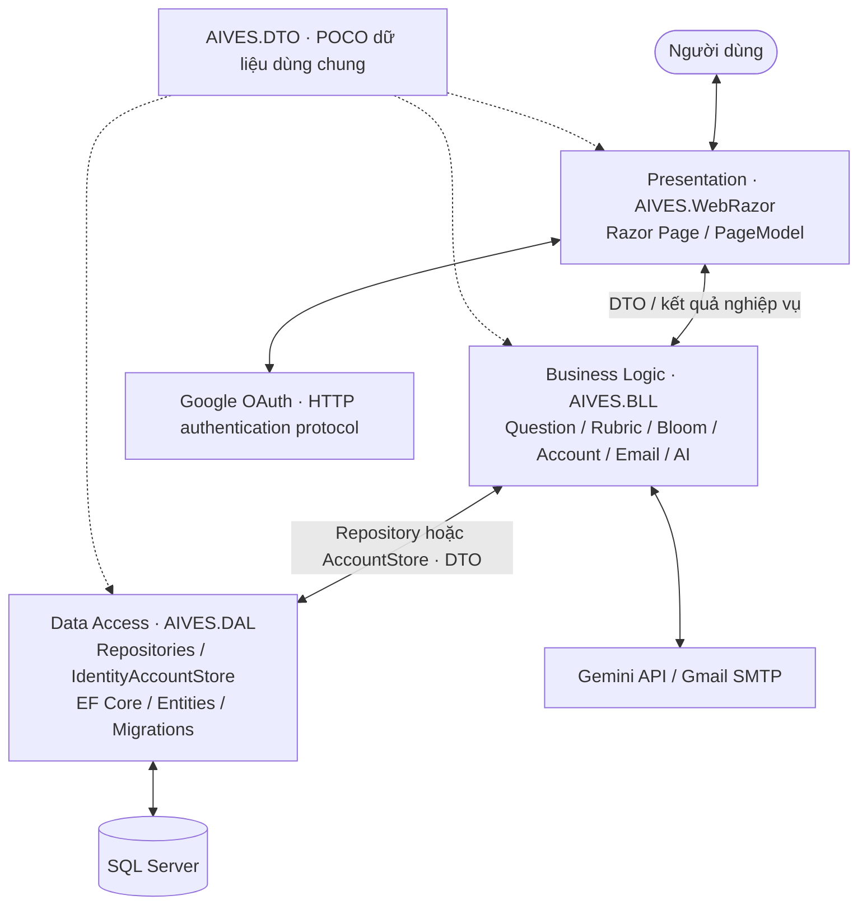

# AIVES – Kiến trúc 3 Layer

Ứng dụng chia thành ba lớp xử lý và một project DTO dùng chung. Đây là phân chia trách nhiệm trong code (layer), không yêu cầu ba máy chủ triển khai (tier).

| Project | Vai trò | Thành phần |
|---|---|---|
| `AIVES.WebRazor` | Presentation / GUI | Razor Pages, PageModels, page view models, wwwroot, HTTP pipeline, Razor Pages/cookie/Google OAuth/SignalR configuration |
| `AIVES.BLL` | Business Logic / BLL | QuestionService, RubricService, BloomLevelService, AccountService, EmailVerificationService, Gemini và SMTP services |
| `AIVES.DAL` | Data Access / DAL | Repositories, IdentityAccountStore, ApplicationDbContext, Entities, Migrations, database initialization |
| `AIVES.DTO` | Dữ liệu trao đổi, không phải lớp xử lý thứ tư | QuestionDto, RubricDto, BloomLevelDto, EmailVerificationCodeDto, UserDto, RegisterRequest, AccountResult, ExternalLoginDto, GeneratedVivaQuestion |
| `AIVES.Tests` | Kiểm thử | Ranh giới assembly, CRUD, validation, OTP, tài khoản và SQL Server integration |



## Sơ đồ hệ thống


- [Bản SVG](AIVES-3-Layer-Architecture.svg): phóng to không mất nét.
- [Bản draw.io](AIVES-3-Layer-Architecture.drawio): mở bằng diagrams.net để chỉnh sửa.
- Sơ đồ phản ánh các thành phần đang có trong source; các module roadmap chỉ ghi chú, không biểu diễn như chức năng đã triển khai.
- Mũi tên hai chiều biểu thị yêu cầu/kết quả, không phải hai project tham chiếu nhau. Tham chiếu mã nguồn vẫn theo chiều UI → BLL → DAL; DTO dùng chung.

## Ranh giới phụ thuộc

- WebRazor tham chiếu trực tiếp BLL và DTO; PageModel không dùng repository, DbContext, EF Core hoặc entity lưu trữ.
- BLL tham chiếu DAL và DTO, kiểm tra quy tắc và điều phối use case; không viết truy vấn EF Core hay sử dụng entity của DAL.
- DAL tham chiếu DTO, ánh xạ DTO với entity nội bộ rồi thực hiện lưu/truy xuất dữ liệu. DAL không phụ thuộc BLL hoặc WebRazor.
- DTO không tham chiếu project ứng dụng, ASP.NET Identity hay EF Core. DTO không có navigation property đến entity.
- `AuthenticationProperties` chỉ là thông tin giao thức xác thực HTTP. Dữ liệu tài khoản và kết quả đăng nhập giữa các lớp dùng DTO.
- `AddRazorPresentation` đăng ký Razor Pages, cookie, Google OAuth, localization và SignalR tại WebRazor. `AddAives` đăng ký BLL và truyền chính sách Identity (mật khẩu, email xác minh, lockout) cho DAL. DAL chỉ đăng ký Identity store/EF và thực thi lưu trữ. `Program.cs` ghép các thành phần và thiết lập middleware.

## Luồng xử lý

1. Razor Page nhận request, kiểm tra `ModelState`, chuyển page view model thành DTO.
2. BLL kiểm tra nội dung, độ dài, thứ tự hiển thị và sự tồn tại của Bloom/rubric trước khi gọi DAL.
3. DAL truy vấn/lưu entity qua EF Core, trả DTO có tên Bloom/rubric cho BLL.
4. BLL trả DTO cho PageModel; PageModel ánh xạ sang page view model và hiển thị.

Đăng ký, xác minh email, gửi lại mã và liên kết Google được điều phối bởi `AccountService`. Mã xác minh được băm, có thời hạn 10 phút, giới hạn 5 lần thử và khoảng chờ gửi lại 1 phút. `EmailVerificationRepository` xử lý toàn bộ việc đọc/ghi mã; SMTP và Gemini được gọi qua interface service.

Lỗi DAL không bị nuốt tại repository mà truyền lên BLL rồi GUI. Lỗi nghiệp vụ dự kiến dùng exception hoặc `AccountResult`; PageModel hiển thị lỗi phù hợp và ghi log lỗi hệ thống. Cập nhật câu hỏi/rubric giữ ngày tạo ban đầu; repository cập nhật entity đã tracking thay vì attach một instance thứ hai cùng ID.

## Chạy và kiểm tra

Từ thư mục gốc, với .NET SDK 10 và SQL Server được cấu hình:

```powershell
dotnet build AIVES_System.slnx -c Release
dotnet test AIVES_System.slnx -c Release
dotnet run --project AIVES.WebRazor
```

User Secrets vẫn thuộc project WebRazor với ID hiện tại. Các khóa ConnectionStrings, Gemini, GmailSmtp, Authentication và DemoAccount được giữ nguyên. Dockerfile restore các project cần thiết trước khi publish WebRazor.

SQL integration test chỉ chạy khi có biến môi trường `AIVES_TEST_SQL_CONNECTION`. Test tạo database riêng có tiền tố `AIVES_LayerTest_`, chạy migration và CRUD, sau đó xóa chính database đó. Không đặt connection string thật vào source. Các test OTP dùng email sender giả, không gửi email ra ngoài; EF InMemory không thay thế kiểm thử ràng buộc quan hệ trên SQL Server.

## EF Core migrations

Entities, DbContext và toàn bộ migration nằm trong DAL. Giữ nguyên ba migration ID và cấu trúc bảng; chỉ chuyển namespace/assembly. `ApplicationDbContextFactory` cho phép tooling đọc model mà không chạy web startup hay seed dữ liệu.

```powershell
dotnet ef migrations has-pending-model-changes --project AIVES.DAL --startup-project AIVES.WebRazor
dotnet ef migrations add TenMigration --project AIVES.DAL --startup-project AIVES.WebRazor --output-dir Migrations
dotnet ef database update --project AIVES.DAL --startup-project AIVES.WebRazor
```

Không cần tạo migration riêng cho việc tách layer. Ứng dụng tiếp tục tự áp dụng migration khi khởi động như trước.

## Sơ đồ


File `AIVES-3-Layer-Architecture.drawio` là bản có thể chỉnh sửa.

## Kiểm tra lại theo yêu cầu ngày 01/10/2026

- Presentation chỉ xử lý HTTP/form, binding, phản hồi và ánh xạ ViewModel ↔ DTO; không gọi DAL hay SQL.
- BLL giữ quy tắc câu hỏi, rubric, chính sách tài khoản, xác minh OTP và điều phối dịch vụ AI/email. Rubric kiểm tra tên ≤ 200 ký tự, mô tả ≤ 1000 ký tự và tổng điểm không âm trước khi lưu.
- DAL là nơi duy nhất chứa EF Core, DbContext, entity, migration, SQL và Identity persistence. Kiểm tra an toàn trước phát hành cookie được adapter Identity thực thi bằng chính sách do BLL cấu hình.
- DTO là các đối tượng trao đổi thuần, không có truy vấn hay phụ thuộc framework. Entity lưu trữ ở DAL; DTO biểu diễn dữ liệu bảng hoặc dữ liệu yêu cầu/kết quả, không bắt buộc mọi DTO tương ứng một bảng (ví dụ RegisterRequest/AccountResult).
- Startup seed/migration là khởi tạo hạ tầng dữ liệu; không phải luồng request GUI truy cập database.
- Kiểm thử ranh giới assembly kiểm tra WebRazor không tham chiếu DAL/EF, BLL không tham chiếu EF/ASP.NET MVC/Google authentication, DAL không tham chiếu UI/BLL và DTO không tham chiếu các tầng.
