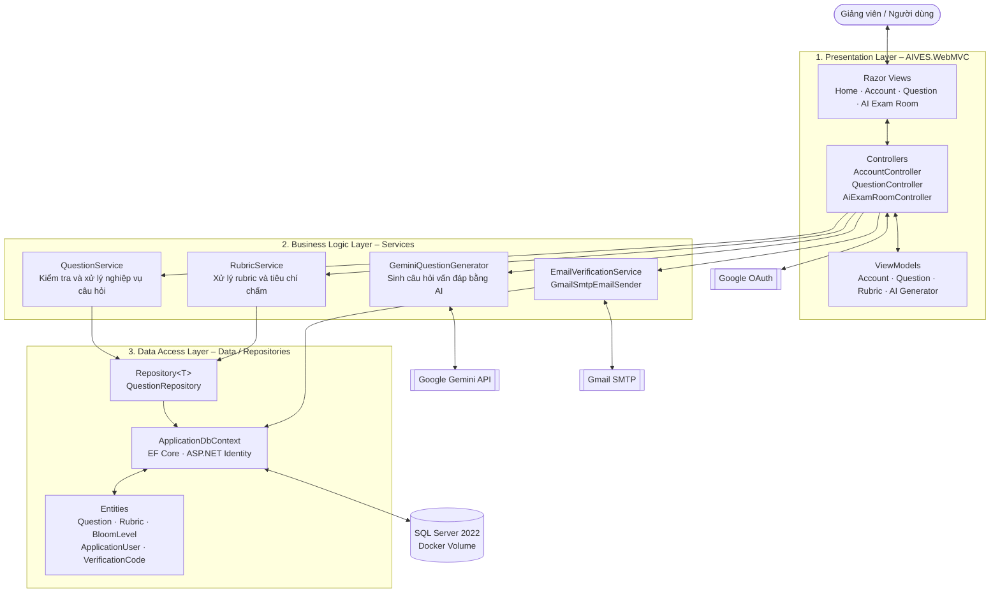

# AIVES – Kiến trúc 3 lớp

## Luồng chính minh họa

1. Giảng viên nhập câu hỏi tại Razor View.
2. `QuestionController` nhận request và chuyển dữ liệu cho `QuestionService`.
3. `QuestionService` kiểm tra nội dung, Bloom level và rubric.
4. `QuestionRepository` thao tác qua `ApplicationDbContext`.
5. EF Core lưu câu hỏi vào SQL Server và kết quả được trả ngược lên giao diện.

## Trách nhiệm các lớp

| Lớp | Thành phần chính | Trách nhiệm |
|---|---|---|
| Presentation | Views, Controllers, ViewModels | Hiển thị UI, nhận request, binding và validation đầu vào |
| Business Logic | Question, Rubric, Gemini, Email services | Thực thi quy tắc nghiệp vụ và điều phối use case |
| Data Access | Repositories, ApplicationDbContext, Entities | Truy xuất dữ liệu bằng EF Core và ánh xạ SQL Server |

