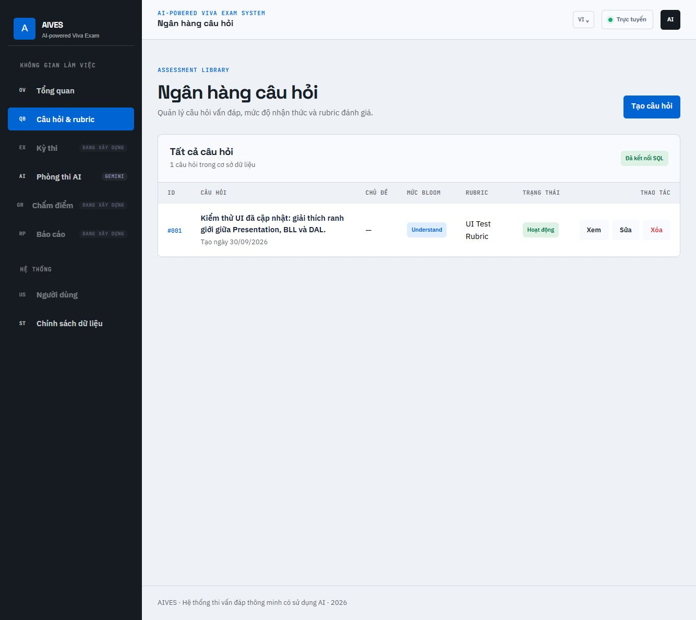
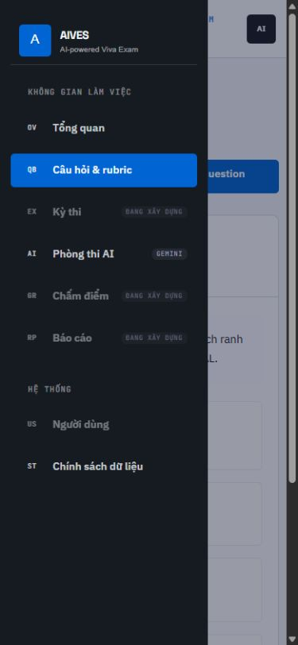

# Báo cáo kiểm thử chức năng AIVES

Ngày kiểm thử: **01/10/2026**, theo giờ Việt Nam.

**Kết luận:** bộ kiểm thử nội bộ pass 83/83 ca. Kiểm tra dịch vụ thật chưa đạt: Gemini trả HTTP 503 và Gmail SMTP từ chối xác thực với mã 534. Vì vậy chưa thể khẳng định mọi tích hợp bên ngoài hoạt động.

## Môi trường và phương pháp

- .NET 10, build Release, ASP.NET Core TestServer, ASP.NET Identity thật và SQL Server trong Docker.
- HTTP test dùng cookie và antiforgery thật; mỗi bộ integration test tạo database riêng có tiền tố `AIVES_FunctionalTest_` hoặc `AIVES_LayerTest_` và xóa chính database đó sau test.
- Test giao diện dùng database `AIVES_UITest_…` riêng, tài khoản giả và bản publish Docker. Database ứng dụng hiện có không được dùng cho CRUD kiểm thử.
- SMTP và Gemini được giả lập trong HTTP test để kiểm tra cả nhánh thành công và nhánh lỗi. Kiểm thử adapter Gemini dùng `HttpMessageHandler` giả, kiểm tra request và parse response.
- Gemini thật được gọi riêng với cấu hình User Secrets hiện có để tạo 1 câu hỏi. SMTP thật được kiểm tra STARTTLS và authentication; **không gửi email ra ngoài**.
- Chrome không khả dụng; thao tác UI thực hiện bằng trình duyệt tích hợp. Responsive kiểm tra ở 390 × 844 px trên bản publish.

## Kết quả tự động

| Nhóm | Số ca | Kết quả |
|---|---:|---|
| Ranh giới layer, DTO, câu hỏi/rubric, OTP | 13 | Pass |
| Nghiệp vụ đăng ký và xác minh tài khoản | 3 | Pass |
| Migration chain, CRUD và OTP đồng thời trên SQL Server | 2 | Pass |
| HTTP và Identity: tài khoản, quyền truy cập, CSRF, CRUD, AI | 40 | Pass |
| Adapter Gemini, validation và SMTP chưa cấu hình | 15 | Pass |
| Nghiệp vụ callback Google OAuth giả lập | 10 | Pass |
| **Tổng nội bộ** | **83** | **83 pass, 0 fail, 0 skip** |

Các trường hợp đã kiểm tra:

- Trang login/register/verify render đúng; trang nội bộ chuyển về login khi chưa xác thực.
- Request POST thiếu antiforgery bị chặn; token vẫn được kiểm tra khi đã đăng nhập.
- Dữ liệu đăng ký thiếu/sai, email ngoài Gmail, mật khẩu ngắn, xác nhận mật khẩu khác và email trùng bị từ chối.
- Đăng ký → nhận OTP giả lập → xác minh → cookie đăng nhập → logout → login chạy trọn luồng.
- Tài khoản chưa xác minh không đăng nhập được; 5 lần nhập sai mật khẩu khóa tài khoản.
- ReturnUrl đến website khác được thay bằng trang nội bộ; cookie xác thực có HttpOnly.
- OTP sai, hết hạn, vượt 5 lần thử, gửi lại quá sớm và tái sử dụng bị chặn. Gửi lại mã mới vô hiệu hóa mã cũ.
- Câu hỏi tạo/xem/sửa/xóa qua HTTP và SQL Server; tên Bloom/rubric hiển thị; lọc Bloom đúng; ngày tạo giữ nguyên khi sửa.
- Câu hỏi quá ngắn, ID Bloom/rubric không tồn tại và thứ tự âm không được lưu. ID câu hỏi không tồn tại trả 404.
- Chủ đề và đáp án có thể để trống; form tạo mới dùng đúng mặc định `IsActive=true`, `DisplayOrder=0`.
- AI render đủ câu hỏi, đáp án và follow-up trong nhánh thành công giả lập; số lượng >10 không gọi generator; lỗi provider hiển thị thông báo.
- Gemini adapter kiểm tra key, request schema, HTTP 401/403/429/500, JSON sai, danh sách rỗng, số câu không khớp, Bloom sai và thiếu follow-up.
- Callback Google giả lập: thiếu thông tin/email, người dùng mới/cũ, tài khoản đã liên kết và liên kết thất bại.

## Giao diện trình duyệt

Đã thao tác đăng nhập bằng tài khoản thử nghiệm, tạo câu hỏi với các trường tùy chọn trống, sửa nội dung và Bloom, xem chi tiết/danh sách. Dữ liệu tiếng Việt được lưu và hiển thị. Bản publish Docker tải CSS/JS đúng; menu mobile đổi sang trạng thái `sidebar open`, trang chi tiết không tràn ngang ở viewport 390 px. Trang AI thiếu API key hiển thị trạng thái cấu hình và khóa nút tạo.





Delete được kiểm tra qua HTTP với database thật; trong phiên UI chỉ dùng dữ liệu thử riêng. Không dùng tài khoản cá nhân để thao tác với Google.

## Dịch vụ thật và giới hạn

| Dịch vụ / module | Kết quả | Ý nghĩa |
|---|---|---|
| Gemini thật, model `gemini-3.8-flash` từ cấu hình hiện tại | **Fail: HTTP 503** | Chưa sinh được câu hỏi từ provider; mã lỗi này không đủ để kết luận API key sai. Cần kiểm tra lại khả dụng của provider/model và thử lại. |
| Gmail SMTP thật | **Fail: 534** | Kết nối được đến SMTP nhưng server từ chối authentication. Cần xác minh Username/App Password và yêu cầu xác thực của tài khoản Gmail; không tự đổi credentials. |
| Google OAuth | **Logic giả lập pass; live chưa xác minh** | Chưa thực hiện đăng nhập và consent trên tài khoản Google thật. Chưa kiểm chứng client, redirect URI hay token exchange thực tế. |
| Rubric | Service/DAL được kiểm tra | Hiện chưa có controller/view riêng cho CRUD rubric; UI câu hỏi chỉ chọn rubric hiện có. |
| Kỳ thi, chấm điểm, báo cáo, quản trị người dùng | Chưa có chức năng thực thi | Sidebar ghi đang xây dựng hoặc chỉ có placeholder; không ghi nhận là pass. |
| STT/TTS, phỏng vấn thích ứng, kết quả thi | Roadmap | Chưa có controller/service triển khai để kiểm thử. |

Nút chọn ngôn ngữ chưa có luồng chuyển ngôn ngữ; trang tạo dùng tiếng Việt trong khi trang sửa/chi tiết/xóa còn tiếng Anh. Đây là giới hạn giao diện hiện có, không được tính là chức năng đa ngôn ngữ đã hoàn thành.

## Lỗi đã sửa và kiểm thử hồi quy

1. ViewModel khai báo trường chủ đề/đáp án non-nullable làm ASP.NET Core tự coi là bắt buộc. Chuyển thành nullable và chuẩn hóa chuỗi rỗng khi tạo DTO.
2. Biểu thức Razor số thứ tự AI render nguyên `.ToString("D2")`. Sửa thành biểu thức đầy đủ; test xác nhận `Q01`, `Q02`.
3. `Create()` trả view không có model nên mặc định trạng thái/thứ tự không được áp dụng. Trả `new QuestionViewModel()`; test kiểm tra checkbox đã chọn và thứ tự 0.
4. Gemini chưa kiểm tra đầu vào tại BLL và chưa xác minh cấu trúc/kích thước kết quả. Bổ sung validation, kiểm tra số câu/Bloom/follow-up và thông báo có kiểm soát khi JSON sai.

## Chạy lại

Từ thư mục gốc:

```powershell
dotnet build AIVES_System.slnx -c Release
# Đặt AIVES_TEST_SQL_CONNECTION từ cấu hình riêng, không ghi mật khẩu vào source.
dotnet test AIVES_System.slnx -c Release --filter "FullyQualifiedName!~LiveGeminiTests"
```

Không có `AIVES_TEST_SQL_CONNECTION` thì HTTP/SQL integration test bị skip; cần đọc số skip trước khi kết luận.

Live Gemini là opt-in qua `AIVES_TEST_GEMINI_API_KEY` và tùy chọn `AIVES_TEST_GEMINI_MODEL`; chạy riêng với filter `FullyQualifiedName~LiveGeminiTests`. SMTP dùng `scripts/check-smtp.py`, nhận credentials qua biến môi trường và không gửi message.

TRX của lần chạy nằm ở `AIVES.Tests/TestResults/all-functions.trx` và `live-gemini.trx`; thư mục kết quả được gitignore để tránh commit log không cần thiết.

## Review trước GitHub

### Các lỗi đã sửa trong vòng review cuối

- **P1 — Google OAuth bỏ qua kết quả Identity:** DAL trước đây chỉ trả boolean, BLL có thể tiếp tục `SignInAsync` khi external login bị lockout/not allowed/2FA. Đã truyền đầy đủ trạng thái bằng DTO và dừng callback khi bị chặn. Mọi lỗi liên kết, kể cả `LoginAlreadyAssociated`, đều dừng đăng nhập. DAL cũng kiểm tra quyền đăng nhập, lockout và 2FA trước khi tạo phiên trực tiếp, kể cả tài khoản mới liên kết Google. 7 ca hồi quy cho BLL và Identity thật.
- **P1 — OTP bị sử dụng đồng thời:** cập nhật đọc–ghi có thể chấp nhận cùng mã hai lần và ghi đè số lần sai. DAL dùng UPDATE có điều kiện cho consume và tăng số lần sai nguyên tử, giới hạn 5 lần; BLL chỉ trả thành công nếu consume cập nhật được đúng một hàng. Kiểm thử SQL với hai DbContext xác nhận không mất số lần sai và chỉ một yêu cầu consume thành công.
- Docker context loại thêm `.env.*`, `secrets.json`, `appsettings.Production.json` và TestResults.

### Những điểm còn cần xử lý trước triển khai production

- **P2 — Gửi lại OTP:** kiểm tra cooldown trong BLL và thay mã trong DAL chưa nằm trong cùng thao tác nguyên tử. Các yêu cầu resend đồng thời có thể vượt cooldown và gửi nhiều mã. Cần transaction/serialization theo user hoặc cơ chế rate limit tập trung. Test hiện tại kiểm tra resend tuần tự.
- **P2 — SMTP gửi thất bại sau lưu OTP:** thay mã được lưu trước khi gửi email. Nếu SMTP lỗi lúc resend, mã cũ đã bị vô hiệu và mã mới chưa đến người dùng; phải đợi cooldown rồi thử lại. Nên có trạng thái delivery/outbox hoặc xử lý phục hồi.
- Gemini thật HTTP 503 và SMTP thật mã 534 chưa được khắc phục bằng cấu hình bên ngoài. Google consent/token exchange thật chưa kiểm thử.
- Các module roadmap và nút VI chưa có chức năng hoàn chỉnh; không xem đây là các chức năng đã pass.

### Kiểm tra bổ sung

- `dotnet list AIVES_System.slnx package --vulnerable --include-transitive`: không có package bị báo vulnerable theo nguồn NuGet hiện tại.
- Quét các mẫu Google API key, Google client secret, GitHub token và private key trên file tracked/non-ignored: không có kết quả. Đây là quét mẫu, không thay thế một công cụ secret scanning đầy đủ.
- Không thay đổi EF model/schema trong vòng review; không tạo migration mới.
- Chưa có PR trên GitHub để chạy công cụ Code Review cho remote CI. Review này thực hiện trực tiếp trên mã nguồn và diff local. Sites không dùng để triển khai vì ứng dụng dùng ASP.NET Core/SQL Server/Docker.
- Worktree đang detached HEAD; thay đổi chưa commit/push. Cần đưa thay đổi lên một branch trước khi đẩy GitHub.

### Kiểm tra cấu trúc lần cuối theo yêu cầu 3 Layer

Đã tách AddPresentation (MVC/cookie/Google HTTP authentication) sang WebMVC; chuyển chính sách Identity sang BLL và để DAL nhận cấu hình cho Identity store. Google package được chuyển từ BLL sang WebMVC. Thêm 3 ca validation rubric, kiểm tra BLL không tham chiếu MVC/Google adapter. Kết quả 83/83 pass (SQL Server thật, không skip), build Release 0 warning/error và EF không có pending model changes. Cấu trúc và vai trò chi tiết tại AIVES-3-Layer-Architecture.md.
